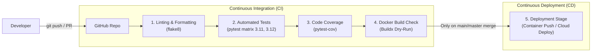

# 🚀 CI/CD Practice & Interview Preparation Guide

This repository contains a lightweight **FastAPI** microservice configured with a production-grade **CI/CD Pipeline** using **GitHub Actions**, **Pytest**, and **Docker**.

---

## 📌 Architecture & Pipeline Flow



---

## 🛠️ Repository Structure

```text
ci-cd-practice/
├── .github/
│   └── workflows/
│       └── ci-cd.yml         # GitHub Actions CI/CD Pipeline
├── app/
│   ├── __init__.py
│   └── main.py               # FastAPI application endpoints (/ and /health)
├── tests/
│   ├── __init__.py
│   └── test_main.py          # Pytest unit tests for API endpoints
├── .dockerignore              # Files excluded from Docker build context
├── .gitignore                # Files excluded from Git version control
├── Dockerfile                # Container definition
├── pytest.ini                # Pytest configuration (pythonpath, testpaths)
├── requirements.txt          # Production and testing dependencies
└── README.md                 # Project and CI/CD interview guide
```

---

## 🧪 Local Testing & Verification

1. **Activate your environment & install dependencies:**
   ```bash
   pip install -r requirements.txt
   ```

2. **Run linting:**
   ```bash
   flake8 . --count --max-line-length=120 --statistics
   ```

3. **Run unit tests with coverage:**
   ```bash
   pytest --cov=app --cov-report=term-missing
   ```

4. **Test Docker build locally:**
   ```bash
   docker build -t ci-cd-practice:latest .
   docker run -d -p 8000:8000 --name test-app ci-cd-practice:latest
   curl http://localhost:8000/health
   docker stop test-app && docker rm test-app
   ```

---

## 🎯 Hands-On Practice Checklist

- [ ] **Step 1:** Initialize git repository:
  ```bash
  git init
  git add .
  git commit -m "feat: setup FastAPI project with tests and CI/CD pipeline"
  ```
- [ ] **Step 2:** Create a new repository on [GitHub](https://github.com/new).
- [ ] **Step 3:** Push the repository:
  ```bash
  git remote add origin https://github.com/<YOUR_USERNAME>/<REPO_NAME>.git
  git branch -M main
  git push -u origin main
  ```
- [ ] **Step 4:** Go to the **Actions** tab on GitHub and observe the pipeline execute all 4 stages.
- [ ] **Step 5 (Simulation):** Create a branch, introduce a bug in `tests/test_main.py` or `app/main.py`, create a Pull Request, and watch GitHub Actions block the PR!
- [ ] **Step 6 (Fix & Merge):** Fix the bug, push to the branch, watch tests turn green, and merge to `main` to trigger the `deploy` stage.

---

## 🧠 Top CI/CD Interview Topics & Answers

### 1. What is the difference between CI, CD (Continuous Delivery), and CD (Continuous Deployment)?
- **CI (Continuous Integration):** Frequently integrating code changes into a shared repository, verified by automated builds, linting, and automated tests.
- **Continuous Delivery:** Automating the release process so that software can be released to production at any time with a **manual approval/button click**.
- **Continuous Deployment:** Every change that passes all stages of the production pipeline is **automatically deployed to production** with no human intervention.

### 2. What are the key stages of a production CI/CD pipeline?
1. **Lint & Static Code Analysis (SAST):** Linting (`flake8`, `eslint`), security vulnerability scanning (`trivy`, `snyk`, `sonarQube`).
2. **Automated Testing:** Unit tests, integration tests, end-to-end tests, code coverage thresholds.
3. **Artifact Building & Packaging:** Compiling code, building Docker images, storing artifacts in registries (GHCR, Docker Hub, AWS ECR).
4. **Deploy to Staging / QA:** Automatic deployment to staging environment for integration/acceptance testing.
5. **Production Deployment:** Rolling update, Blue-Green, or Canary deployment to production with health checks.
6. **Monitoring & Rollback:** Automated health checks, synthetic monitoring, and automated rollback if error rates spike.

### 3. What deployment strategies do you know?
- **Rolling Deployment:** Gradually updates instances of the old version with instances of the new version with zero downtime.
- **Blue-Green Deployment:** Two identical environments (Blue = live, Green = new). Traffic is switched instantly via load balancer/router. Instant rollback if needed.
- **Canary Deployment:** Releases changes to a small fraction of users (e.g. 5%) first, monitors metrics, and gradually ramps up to 100%.
- **Recreate:** Stops all old instances before starting new ones (causes downtime, good for dev/database schema mismatches).

### 4. How do you optimize pipeline speed?
- **Dependency & Layer Caching:** Cache package managers (`pip`, `npm`) and use Docker BuildKit layer caching.
- **Parallel Jobs:** Run unit tests, linting, and security scans concurrently using matrix builds.
- **Selective Triggers:** Use `paths` filtering in GitHub Actions to only trigger workflows when relevant files change.
- **Lightweight Runner Images:** Use slim base images (e.g., `alpine` or `python:3.12-slim`).
